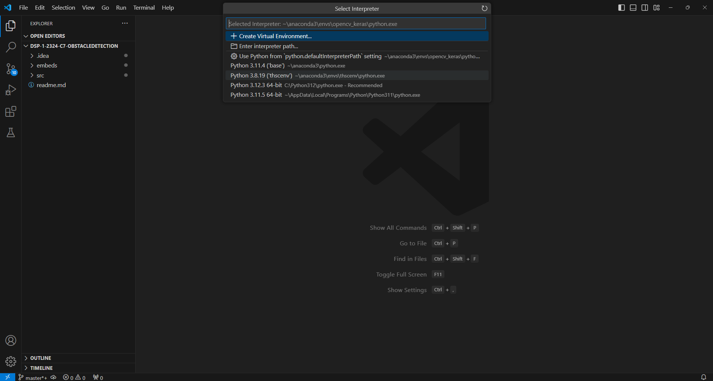

# Obstacle Detection for The Visually Impaired

DLSU Computer Engineering Thesis 
Co-Developed by: Cian Marlo Santos, Ellise Johanne Pag-ong, and Axcel Justin Tidalgo. It is a machine learning model created with Ultralytics YOLOv8 and OpenCV, meant to be deployed onto a vest-mounted Raspberry Pi 3 and used alongside a live camera feed. <br>
<br>
The resulting coordinates and classifications of the obstacle detection model will be sent to other microcontroller modules which will inform the user through audio and haptic outputs. This Project is currently in the machine learning development phase, while the output microcontroller module is being developed independently of this repository.
<br>

## Dependencies and Installation

This project uses the following libraries and tools:<br>
- conda 23.7.4 (for installation)
- OpenCV
- Python 3.8 
- PyTorch 1.8
- Ultralytics
- Numpy
- CUDA (for training)
- scikit-learn (for training)

### Installation Guide (Using Anaconda)

1. Install [Anaconda](https://www.anaconda.com/download), [Python](https://www.python.org/downloads/) and your IDE of choice (Tutorials for [PyCharm](https://www.jetbrains.com/pycharm/download/?section=windowshttps://www.jetbrains.com/pycharm/download/?section=windows) and [VSCode](https://code.visualstudio.com/download) are included in this guide)
2. Open Anaconda Prompt terminal<br><br>
 <br><br>
3. In Anaconda Prompt, create an environment with the preferred python version with the following command:<br>
```
conda create -n <env> python=3.8
```
&nbsp;&nbsp;&nbsp;&nbsp;&nbsp;&nbsp; Replace `<env>` with the environment name of your choice. For this guide, the environment name in screenshots will be `thscenv`<br>

&nbsp;&nbsp;&nbsp;&nbsp;&nbsp;&nbsp; You may be asked to install additional libraries, type y to proceed<br><br>


4. Once the libraries have been installed, activate the environment with the command
```
conda activate <env>
```
&nbsp;&nbsp;&nbsp;&nbsp;&nbsp;&nbsp; after which your interface should look like this:<br><br>
<br><br>

5. All remaining libraries with be installed as Ultralytics' dependencies. Install PyTorch, CUDA, scikit-learn and Ultralytics with the following command:
```
conda install -c pytorch -c nvidia -c conda-forge pytorch torchvision pytorch-cuda=11.8 ultralytics scikit-learn
```
&nbsp;&nbsp;&nbsp;&nbsp;&nbsp;&nbsp; You will be prompted to install additional libraries again. Ensure that the libraries mentioned at the start of this guide are included.<br>

---

## Setting up Conda environment with VSCode (Skip Forward for PyCharm setup)

Once you have cloned this repository, enter Ctrl+Shift+P while in the code editor to open the Command Palette:<br><br>
<br><br>
Select Python: Select Interpreter then select your conda environment. Again, the environment used in the screenshot is `thscenv` <br><br>
<br><br>
### The model can now be run in VSCode. **Happy Coding!**<br><br><br><br>

## Setting up Conda environment with PyCharm

Once you have cloned this repository, Open Settings (Ctrl+Alt+S or File → Settings) in PyCharm<br>
Go to Project → Python Interpreter<br><br>
<br><br>
Click Add Interpreter<br>
Select Conda Environment → Use Existing Environment<br>
Select your conda environment. Again, the environment used in the screenshot is `thscenv`<br><br>
<br><br>
### The model can now be run in PyCharm. **Happy Coding!**
